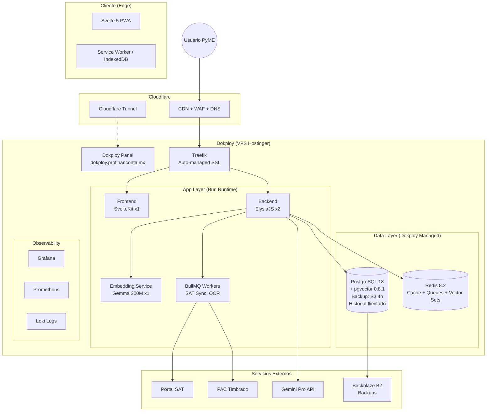
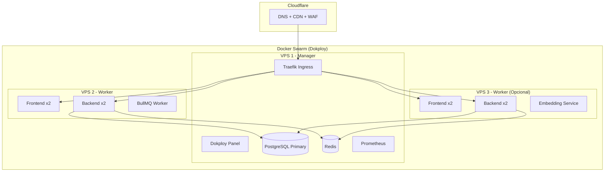
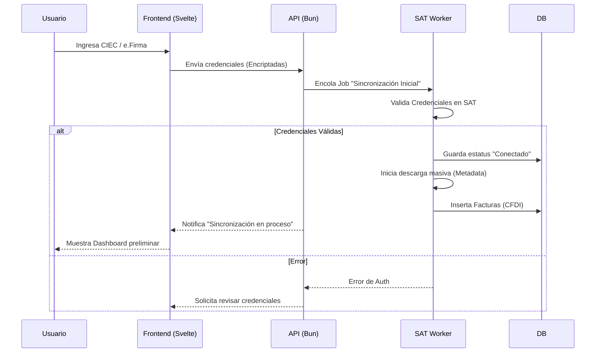

# 📐 BLUEPRINTS DE ARQUITECTURA

**Última Actualización:** 12 Diciembre 2025  
**Plataforma:** Dokploy (Docker Swarm)  
**Total Features:** 278 características  
**Killer Features:** 45 ventajas competitivas documentadas

## 1. Arquitectura de Sistema (C4 Container Level) - Dokploy

## 2. Arquitectura Multi-Server (Fase 2 - ~6 meses)

## 2. Flujo Crítico: Onboarding y Sincronización SAT

## 3. Interpretación y Propósito de los Diagramas

- **Arquitectura C4:** resume el modelo operativo completo: el cliente (PWA Svelte) consume servicios expuestos por ElysiaJS detrás de Traefik, mientras que los workers SAT interactúan con portales externos y alimentan PostgreSQL/Redis. Este blueprint guía a DevOps para mapear contenedores y asegurar redes internas.
- **Flujo de Onboarding:** describe los pasos para asegurar credenciales SAT sin violar compliance. Destaca puntos de cifrado, colas asíncronas y retroalimentación al usuario, sirviendo como referencia para diseñar pruebas E2E y alarmas.

## 4. Ventajas Competitivas en la Arquitectura

Nuestra arquitectura implementa **45 killer features** que nos diferencian:

| Componente | Killer Feature | Ventaja vs Competencia |
|:-----------|:---------------|:-----------------------|
| **PostgreSQL 18** | Historial ilimitado (KIL-012) | Contpaqi solo 2 años |
| **BullMQ Workers** | Sync SAT automático (KIL-003) | 0 trabajo manual vs Contpaqi/Aspel |
| **Gemini Vision** | OCR tickets MX (KIL-030) | Único con contexto mexicano |
| **Prophet ML** | Predictor flujo 90d (KIL-026) | Nadie más lo tiene |
| **Traefik** | SSL automático + Rate limiting | Contpaqi requiere config manual |
| **Dokploy** | Updates sin downtime (KIL-011) | Contpaqi rompe al actualizar |
| **Cloud Native** | Sin instalación (KIL-010) | Contpaqi requiere SQL Server |

**Referencia:** Ver `PROJECT_CHARACTERISTICS/12_KILLER_FEATURES_VS_COMPETENCIA.md` para análisis completo.

## 5. Conexiones con Otros Artifacts

- **Stack Tecnológico:** cada nodo mostrado está descrito con versiones y ADR en `03_STACK_TECNOLOGICO_DEFINITIVO.md`.
- **Glosario Técnico:** entidades como SAT Worker, API Gateway o Portal SAT se definen funcionalmente en `01_GLOSARIO_TECNICO_MASTER.md`.
- **Mapa Tecnológico:** relación entre cada tecnología y features en `PROJECT_CHARACTERISTICS/13_MAPA_TECNOLOGIA_FEATURES.md`.
- **Roadmap de Construcción:** los pasos para materializar estos bloques están especificados en `DOCUMENTACION_MAESTRA/ROADMAP_CONSTRUCCION_PASO_A_PASO.md`.

## 6. Cómo Mantener Actualizados los Blueprints

1. **Cambios Infra:** si se agrega un servicio (p.ej. Kafka), añádelo al diagrama C4 y documenta la razón en el stack tecnológico.
2. **Flujos Nuevos:** cualquier flujo crítico (p.ej. cierre contable) debe plasmarse como secuencia adicional para mantener la trazabilidad.
3. **Killer Features:** si una nueva feature requiere cambios arquitectónicos, actualizar ambos documentos (este + Módulo 12).
4. **Revisión Periódica:** programar verificación trimestral durante auditorías para asegurar que los diagramas reflejen el estado real del despliegue.

---

**Última actualización:** 12 Diciembre 2025  
**Próxima revisión:** Marzo 2026  
**Total features implementables:** 278
