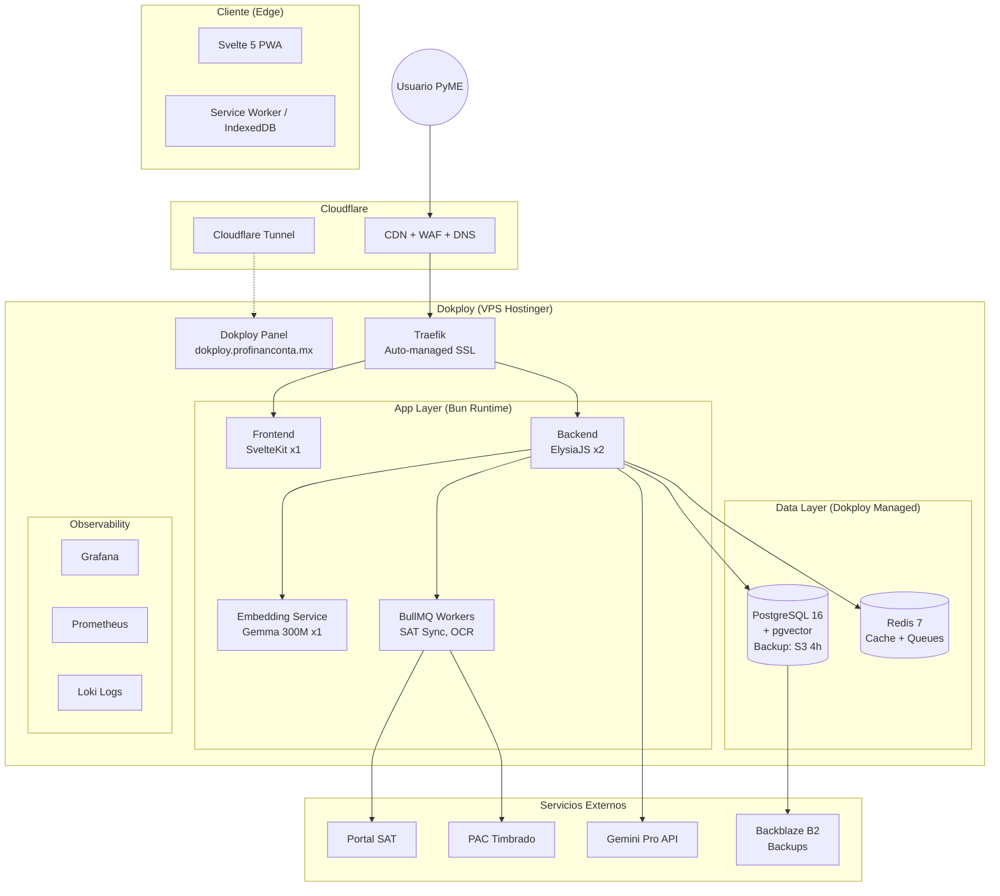

# 📐 BLUEPRINTS DE ARQUITECTURA
**Última Actualización:** 1 Diciembre 2025  
**Plataforma:** Dokploy (Docker Swarm)

## 1. Arquitectura de Sistema (C4 Container Level) - Dokploy

## 2. Arquitectura Multi-Server (Fase 2 - ~6 meses)

## 2. Flujo Crítico: Onboarding y Sincronización SAT

```mermaid
sequenceDiagram
    participant U as Usuario
    participant F as Frontend (Svelte)
    participant A as API (Bun)
    participant S as SAT Worker
    participant D as DB

    U->>F: Ingresa CIEC / e.Firma
    F->>A: Envía credenciales (Encriptadas)
    A->>S: Encola Job "Sincronización Inicial"
    S->>S: Valida Credenciales en SAT
    alt Credenciales Válidas
        S->>D: Guarda estatus "Conectado"
        S->>S: Inicia descarga masiva (Metadata)
        S->>D: Inserta Facturas (CFDI)
        A-->>F: Notifica "Sincronización en proceso"
        F-->>U: Muestra Dashboard preliminar
    else Error
        S-->>A: Error de Auth
        A-->>F: Solicita revisar credenciales
    end
```

## 3. Interpretación y Propósito de los Diagramas
- **Arquitectura C4:** resume el modelo operativo completo: el cliente (PWA Svelte) consume servicios expuestos por ElysiaJS detrás de Traefik, mientras que los workers SAT interactúan con portales externos y alimentan PostgreSQL/Redis. Este blueprint guía a DevOps para mapear contenedores y asegurar redes internas.
- **Flujo de Onboarding:** describe los pasos para asegurar credenciales SAT sin violar compliance. Destaca puntos de cifrado, colas asíncronas y retroalimentación al usuario, sirviendo como referencia para diseñar pruebas E2E y alarmas.

## 4. Conexiones con Otros Artifacts
- **Stack Tecnológico:** cada nodo mostrado está descrito con versiones y ADR en `03_STACK_TECNOLOGICO_DEFINITIVO.md`.
- **Glosario Técnico:** entidades como SAT Worker, API Gateway o Portal SAT se definen funcionalmente en `01_GLOSARIO_TECNICO_MASTER.md`.
- **Roadmap de Construcción:** los pasos para materializar estos bloques están especificados en `DOCUMENTACION_MAESTRA/ROADMAP_CONSTRUCCION_PASO_A_PASO.md`.

## 5. Cómo Mantener Actualizados los Blueprints
1. **Cambios Infra:** si se agrega un servicio (p.ej. Kafka), añádelo al diagrama C4 y documenta la razón en el stack tecnológico.
2. **Flujos Nuevos:** cualquier flujo crítico (p.ej. cierre contable) debe plasmarse como secuencia adicional para mantener la trazabilidad.
3. **Revisión Periódica:** programar verificación trimestral durante auditorías para asegurar que los diagramas reflejen el estado real del despliegue.
