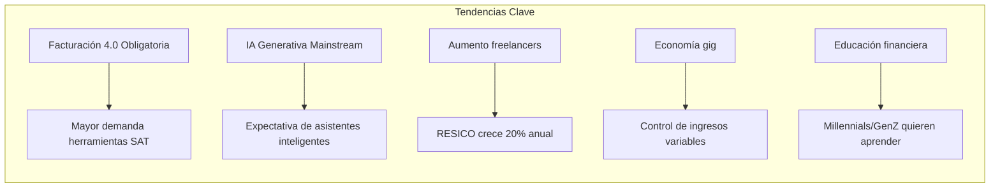

# 📊 ANÁLISIS DE MERCADO Y COMPETENCIA DIRECTA

**Proyecto:** PRO_FINAN_CONTA_PYM  
**Mercado Objetivo:** México - PyMEs y Finanzas Personales  
**Versión:** 2.0  
**Fecha:** 8 Diciembre 2025

---

## 🔗 DOCUMENTOS COMPLEMENTARIOS

| Documento                                                                | Descripción                             |
| :----------------------------------------------------------------------- | :-------------------------------------- |
| [03_40_PERFILES_PROFESIONALES](03_40_PERFILES_PROFESIONALES.md)          | 40 perfiles expandidos con neurociencia |
| [07_100_NECESIDADES_DIARIAS](07_100_NECESIDADES_DIARIAS_NO_RESUELTAS.md) | 100+ necesidades diarias no resueltas   |
| [02_15_TIPOS_CLIENTE](02_15_TIPOS_CLIENTE.md)                            | 15 tipos de cliente originales (JTBD)   |

---

## 📋 ÍNDICE

1. [Tamaño del Mercado](#tamaño-del-mercado)
2. [Competencia Directa](#competencia-directa)
3. [Análisis FODA](#análisis-foda)
4. [Diferenciadores Clave](#diferenciadores-clave)
5. [Tendencias del Mercado](#tendencias-del-mercado)
6. [Barreras de Entrada](#barreras-de-entrada)
7. [Estrategia de Posicionamiento](#estrategia-de-posicionamiento)

---

## 📈 TAMAÑO DEL MERCADO

### México en Números (2024-2025)

| Métrica                                   | Valor         | Fuente   |
| :---------------------------------------- | :------------ | :------- |
| **Población Total**                       | 130+ millones | INEGI    |
| **PEA (Población Económicamente Activa)** | 60 millones   | INEGI    |
| **PyMEs Registradas**                     | 4.9 millones  | INEGI    |
| **PyMEs con Contabilidad Digital**        | ~15%          | CONDUSEF |
| **Usuarios de Banca Móvil**               | 45 millones   | CNBV     |
| **Penetración Smartphone**                | 78%           | IFT      |
| **Régimen RESICO**                        | 4+ millones   | SAT      |
| **Contribuyentes Activos**                | 82 millones   | SAT      |

### Mercado Potencial (TAM, SAM, SOM)

```
TAM (Total Addressable Market)
├── 4.9M PyMEs × $300 USD/año = $1,470M USD
└── 60M PEA × $50 USD/año = $3,000M USD
    TOTAL TAM: ~$4,470M USD

SAM (Serviceable Available Market)
├── PyMEs que necesitan contabilidad SAT: 2.5M
├── Personas que buscan finanzas personales: 15M
└── TOTAL SAM: ~$900M USD

SOM (Serviceable Obtainable Market - 3 años)
├── Objetivo realista: 0.5% del SAM
└── TOTAL SOM: ~$4.5M USD
```

---

## 🎯 COMPETENCIA DIRECTA

### Matriz Competitiva

| App                    |   Precio    | SAT | IA  | Gamificación | Neurociencia | Offline | Open Source |
| :--------------------- | :---------: | :-: | :-: | :----------: | :----------: | :-----: | :---------: |
| **Nuestro Proyecto**   |  Freemium   | ✅  | ✅  |      ✅      |      ✅      |   ✅    |     ✅      |
| Finerio                |   Gratis    | ❌  | ❌  |      ❌      |      ❌      |   ❌    |     ❌      |
| Monefy                 |   $49/mes   | ❌  | ❌  |      ❌      |      ❌      |   ✅    |     ❌      |
| Contabilizate          |  $199/mes   | ✅  | ❌  |      ❌      |      ❌      |   ❌    |     ❌      |
| ASPEL COI              | $3,500/lic  | ✅  | ❌  |      ❌      |      ❌      |   ✅    |     ❌      |
| QuickBooks MX          |  $299/mes   | ✅  | ❌  |      ❌      |      ❌      |   ❌    |     ❌      |
| Conta365               |  $199/mes   | ✅  | ❌  |      ❌      |      ❌      |   ❌    |     ❌      |
| YNAB                   | $99 USD/año | ❌  | ❌  |      ❌      |      ❌      |   ❌    |     ❌      |
| Mint (discontinuado)   |   Gratis    | ❌  | ❌  |      ❌      |      ❌      |   ❌    |     ❌      |
| Wallet by BudgetBakers |   $49/año   | ❌  | ❌  |      ❌      |      ❌      |   ✅    |     ❌      |

> **🧠 Diferenciador clave:** Somos la única app que aplica neurociencias (cognitiva, afectiva, del desarrollo y neuropsicología) al diseño de experiencia financiera.

### Análisis Detallado por Competidor

#### 1. **Finerio** (Finanzas Personales)

- **Fortalezas:** Gratis, conexión bancaria, interfaz limpia
- **Debilidades:** Sin SAT, sin gamificación, requiere conexión constante
- **Modelo:** Monetizan con datos agregados
- **Oportunidad:** Usuarios migrarán si ofrecemos SAT + gamificación

#### 2. **ASPEL COI/NOI** (Contabilidad Empresarial)

- **Fortalezas:** Dominio del mercado PyME mexicano, cumplimiento SAT
- **Debilidades:** Software legacy, UX anticuada, costoso
- **Modelo:** Licencia perpetua + soporte anual
- **Oportunidad:** Modernizar experiencia con mismo cumplimiento

#### 3. **QuickBooks México** (Contabilidad Cloud)

- **Fortalezas:** Marca global, integraciones, soporte 24/7
- **Debilidades:** Costoso, curva de aprendizaje, pensado para USA
- **Modelo:** SaaS mensual
- **Oportunidad:** Más barato y localizado para México

#### 4. **Contpaqi** (Contabilidad Empresarial)

- **Fortalezas:** Líder en PyMEs, cumplimiento SAT total
- **Debilidades:** Muy técnico, requiere contador, caro
- **Modelo:** Licencias + suscripción
- **Oportunidad:** Democratizar para no-contadores

---

## 📊 ANÁLISIS FODA

### Fortalezas (Strengths)

|  #  | Fortaleza                                   | Impacto  |
| :-: | :------------------------------------------ | :------: |
| F1  | **Cumplimiento SAT nativo** (CFDI, RESICO)  | 🔴 Alto  |
| F2  | **IA local** sin costos de API externos     | 🔴 Alto  |
| F3  | **Gamificación** para engagement            | 🟡 Medio |
| F4  | **100% Open Source** - confianza            | 🔴 Alto  |
| F5  | **Offline-first** - funciona sin internet   | 🟡 Medio |
| F6  | **Diseño mexicano** - UX localizada         | 🟡 Medio |
| F7  | **Freemium real** - funciones útiles gratis | 🔴 Alto  |

### Debilidades (Weaknesses)

|  #  | Debilidad                           | Mitigación                  |
| :-: | :---------------------------------- | :-------------------------- |
| D1  | **Nuevo en mercado** - sin marca    | Marketing de contenido, SEO |
| D2  | **Recursos limitados** - startup    | Open source + comunidad     |
| D3  | **Sin conexión bancaria** (inicial) | Roadmap fase 2              |
| D4  | **Solo web** (inicial)              | PWA + app nativa fase 2     |

### Oportunidades (Opportunities)

|  #  | Oportunidad                              | Timeline  |
| :-: | :--------------------------------------- | :-------: |
| O1  | **4M+ en RESICO** necesitan herramientas | Inmediato |
| O2  | **Facturación 4.0** obligatoria          |   2024+   |
| O3  | **Educación financiera** trending        | Continuo  |
| O4  | **Insatisfacción con ASPEL**             | Inmediato |
| O5  | **IA democratizada** - diferenciador     | 2024-2025 |

### Amenazas (Threats)

|  #  | Amenaza                          | Estrategia               |
| :-: | :------------------------------- | :----------------------- |
| A1  | **Bancos lanzan apps** similares | Nicho SAT + gamificación |
| A2  | **Cambios regulatorios** SAT     | Arquitectura flexible    |
| A3  | **Competidor con más recursos**  | Comunidad + nicho        |
| A4  | **Brechas de seguridad**         | Auditorías constantes    |

---

## 💎 DIFERENCIADORES CLAVE

### Lo que NADIE más ofrece:

```
┌─────────────────────────────────────────────────────────────┐
│                    PROPUESTA DE VALOR ÚNICA                 │
├─────────────────────────────────────────────────────────────┤
│                                                             │
│  "La ÚNICA app que combina finanzas personales,             │
│   contabilidad PyME con cumplimiento SAT,                   │
│   inteligencia artificial LOCAL y gamificación              │
│   en una plataforma 100% Open Source                        │
│   diseñada POR mexicanos PARA mexicanos"                    │
│                                                             │
└─────────────────────────────────────────────────────────────┘
```

### Tabla de Diferenciadores

| Diferenciador                 | Nosotros                    | Competencia          |
| :---------------------------- | :-------------------------- | :------------------- |
| **SAT + Finanzas Personales** | ✅ Integrado                | Separado             |
| **IA sin costo extra**        | ✅ Local (Gemma)            | ❌ o API cara        |
| **Gamificación financiera**   | ✅ Logros, niveles, streaks | ❌ Inexistente       |
| **Open Source**               | ✅ 100% código abierto      | ❌ Propietario       |
| **Offline capable**           | ✅ PWA + IndexedDB          | ❌ Requiere internet |
| **Precio**                    | Freemium ($0-$99)           | $199-$3500/año       |
| **Privacidad**                | ✅ Datos locales            | ❌ En sus servers    |

---

## 📈 TENDENCIAS DEL MERCADO

### 2024-2026 Outlook



### Métricas de Tendencia

| Tendencia                 |  Crecimiento  | Impacto en Proyecto           |
| :------------------------ | :-----------: | :---------------------------- |
| **RESICO contribuyentes** |  +20% anual   | 🔴 Alto - más usuarios        |
| **Facturación 4.0**       |  Obligatoria  | 🔴 Crítico - necesidad        |
| **Apps finanzas**         | +15% usuarios | 🟡 Medio - competencia        |
| **IA en finanzas**        | +40% adopción | 🔴 Alto - diferenciador       |
| **Privacidad datos**      |   Creciente   | 🔴 Alto - ventaja open source |

---

## 🚧 BARRERAS DE ENTRADA

### Para Nuevos Competidores

| Barrera                     | Dificultad | Nuestra Posición     |
| :-------------------------- | :--------: | :------------------- |
| **Cumplimiento SAT**        |  🔴 Alta   | Ya implementado      |
| **Desarrollo de IA**        |  🔴 Alta   | EmbeddingGemma local |
| **Comunidad Open Source**   |  🟡 Media  | Construyendo         |
| **Confianza del usuario**   |  🔴 Alta   | Transparencia código |
| **Integraciones bancarias** |  🔴 Alta   | Roadmap fase 2       |

### Para Nosotros

| Barrera                | Estrategia                        |
| :--------------------- | :-------------------------------- |
| **Marca desconocida**  | SEO, content marketing, comunidad |
| **Recursos limitados** | Open source contributors          |
| **Soporte técnico**    | Documentación + comunidad         |

---

## 🎯 ESTRATEGIA DE POSICIONAMIENTO

### Mapa de Posicionamiento

```
                        PRECIO ALTO
                             │
                             │
              ASPEL ●        │        ● QuickBooks
                             │
    COMPLEJIDAD ─────────────┼────────────── SIMPLICIDAD
       ALTA                  │                  ALTA
                             │
       Contpaqi ●            │     ● Finerio
                             │
                    ★ NOSOTROS
                             │
                        PRECIO BAJO
```

### Statement de Posicionamiento

> **Para** PyMEs mexicanas y personas que quieren control financiero total  
> **Que** necesitan cumplir con el SAT sin ser contadores  
> **Nuestro producto** es la plataforma de finanzas inteligente  
> **Que** simplifica la contabilidad fiscal con IA y gamificación  
> **A diferencia de** ASPEL y QuickBooks  
> **Nuestro producto** es gratuito, open source y diseñado para México

### Pilares de Comunicación

```
┌────────────────┬────────────────┬────────────────┐
│   CONFIANZA    │  SIMPLICIDAD   │  INTELIGENCIA  │
├────────────────┼────────────────┼────────────────┤
│ • Open Source  │ • Sin jerga    │ • IA que       │
│ • Datos locales│   contable     │   explica      │
│ • Auditable    │ • Guías paso   │ • Predicciones │
│ • Sin sorpresas│   a paso       │ • Automatización│
│ • Comunidad    │ • 5 minutos/día│ • Insights     │
└────────────────┴────────────────┴────────────────┘
```

---

## 📊 PROYECCIÓN DE MERCADO

### Escenario Conservador (3 años)

|  Año  | Usuarios Gratis | Usuarios Premium |     MRR      |
| :---: | :-------------: | :--------------: | :----------: |
| Año 1 |     10,000      |     200 (2%)     | $10,000 USD  |
| Año 2 |     50,000      |    1,500 (3%)    | $75,000 USD  |
| Año 3 |     150,000     |    6,000 (4%)    | $300,000 USD |

### Métricas Objetivo

| Métrica                      |  Año 1   |  Año 2   |  Año 3   |
| :--------------------------- | :------: | :------: | :------: |
| **CAC** (Costo Adq. Cliente) |  $5 USD  |  $4 USD  |  $3 USD  |
| **LTV** (Lifetime Value)     | $150 USD | $200 USD | $250 USD |
| **Churn Rate**               |    8%    |    6%    |    4%    |
| **NPS**                      |    40    |    50    |    60    |

---

## 🏆 CONCLUSIÓN

### Por qué ganaremos:

1. **Nicho específico:** México + SAT + PyME + Personal
2. **Tecnología moderna:** Svelte + IA local + PWA
3. **Modelo de negocio:** Freemium generoso, premium valioso
4. **Comunidad:** Open source = confianza + contribuciones
5. **Timing:** Facturación 4.0 + RESICO + IA mainstream

---

**Siguiente documento:** `02_15_TIPOS_CLIENTE.md`
