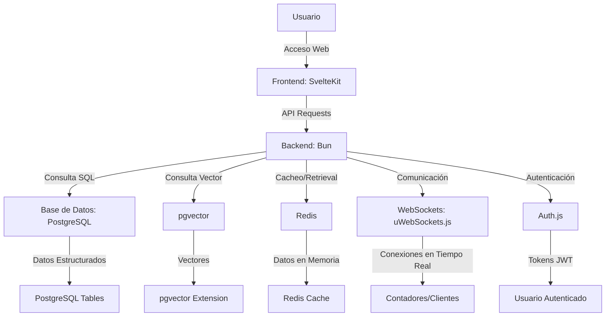

# 📊 DOCUMENTO 01: VISIÓN ESTRATÉGICA

## Aplicación Web de Finanzas Personales y Contabilidad para México 2026

---

**Versión:** 3.1 CORREGIDA  
**Fecha:** 26 de Enero de 2026  
**Última Actualización:** Stack corregido - SIN Tailwind, SIN React, SIN Next  
**Confidencialidad:** Uso Interno  
**Audiencia:** Stakeholders, Equipo Completo, Gobierno, Inversores, Usuarios  
**Desarrollador:** Proyecto individual (1 programador, recién egresado)  
**Recursos:** Bootstrap total ($0 inversión inicial)  
**Situación:** Sin empleo, sin recursos financieros, con acceso GitHub Student Pack

---

**Stack Tecnológico Definitivo (Actualizado Noviembre 2025):**

- **Runtime:** Bun 1.3.3 (primario) + Node.js 24.11.1 LTS (fallback/WebSockets)
- **Framework Frontend:** SvelteKit 2.49.0 + Svelte 5.43.14 (Runes)
- **Estilos:** CSS Nativo con Variables CSS + PostCSS para autoprefixer (SIN frameworks CSS)
  - Razón: Máximo control, bundle más ligero, sin dependencias externas
  - Variables CSS para theming
  - PostCSS solo para compatibilidad navegadores
- **Base de Datos:** PostgreSQL 18.1 + pgvector + Redis 8.0.2
- **ORM:** Drizzle ORM 0.44.7 (primario Bun) + Prisma 6.1.0 (servicios Node)
- **Embeddings:** EmbeddingGemma-300M (Google DeepMind, <200MB RAM cuantizado, open-source)
- **Autenticación:** Auth.js 1.11.1 (JWT + Refresh Token + 2FA opcional)
- **WebSockets:** uWebSockets.js (Node LTS, hasta 50K conexiones simultáneas)
- **Testing:** Playwright 1.49.1 (E2E) + Vitest 4.0.13 + bun test (unit)
- **Deploy:** PM2 5.4.3 + Docker 27.x + Docker Compose v2.29 + Traefik 3.1 (reverse proxy)
- **Monitoreo:** Grafana 11.3.1 + Prometheus 3.0.1 + Sentry 10.20 (SDK Svelte)
- **Infraestructura:** VPS Hostinger KVM 4 (4 vCPU, 16 GB RAM, 200 GB NVMe, 16 TB bandwidth)
- **Escalabilidad Futura:** VPS Hostinger KVM 8 (8 vCPU, 32 GB RAM, 400 GB NVMe, 32 TB bandwidth) - cuando se justifique

**Decisión Arquitectónica Clave:**

- ❌ **Eliminados:** React, Next.js, Nuxt, TailwindCSS, Vercel (NO forman parte del stack)
- ✅ **Por qué SvelteKit:** Performance superior (compilación), bundle más ligero, DX excelente, SSR nativo, menor complejidad
- ✅ **Por qué CSS Nativo:** Control total, sin dependencias, bundle mínimo, futuro-proof
- ✅ **Por qué Bun:** 3x más rápido que Node.js, compatibilidad total con npm, hot reload instantáneo, TypeScript nativo
- ✅ **Por qué PostgreSQL 18:** Características clave para gestión contable (particionado, columnas generadas virtuales, compresión, I/O asíncrono con io_uring = 3x mejor performance)
- ✅ **Por qué Redis 8:** 87% menos latencia, 2x más operaciones/segundo, estructuras Time Series con compresión eficiente, JSON nativo

**Sistema de Estilos (CSS Nativo):**

```css
/* Variables CSS para theming y consistencia */
:root {
  --color-primary: #3b82f6;
  --color-secondary: #10b981;
  --color-danger: #ef4444;
  --spacing-unit: 8px;
  --border-radius: 8px;
  --font-family: system-ui, -apple-system, sans-serif;
}

/* PostCSS config mínimo */
{
  "plugins": {
    "autoprefixer": {}
  }
}
```

---

## 📑 TABLA DE CONTENIDOS

1. [Resumen Ejecutivo](#1-resumen-ejecutivo)
2. [Contexto del Proyecto (Historia Personal)](#2-contexto-del-proyecto)
3. [Análisis del Mercado Mexicano 2026](#3-análisis-del-mercado-mexicano-2026)
4. [Propuesta de Valor Única](#4-propuesta-de-valor-única)
5. [Segmentos de Usuario y Personas](#5-segmentos-de-usuario-y-personas)
6. [Modelo de Negocio Freemium Optimizado](#6-modelo-de-negocio-freemium-optimizado)
7. [Unit Economics y Proyecciones Financieras](#7-unit-economics-y-proyecciones-financieras)
8. [Análisis Competitivo y Posicionamiento (SWOT)](#8-análisis-competitivo-y-posicionamiento)
9. [Ventajas Competitivas Sostenibles (Moats)](#9-ventajas-competitivas-sostenibles)
10. [Arquitectura Tecnológica de Alto Nivel](#10-arquitectura-tecnológica-de-alto-nivel)
11. [Búsqueda Semántica con pgvector (Feature Premium)](#11-búsqueda-semántica-con-pgvector)
12. [Seguridad y Privacidad (Nivel Bancario++)](#12-seguridad-y-privacidad)
13. [Gestión de Almacenamiento y Datos](#13-gestión-de-almacenamiento-y-datos)
14. [Roadmap Estratégico 18 Meses](#14-roadmap-estratégico-18-meses)
15. [Estrategias de Marketing y Adquisición (Costo $0)](#15-estrategias-de-marketing-y-adquisición)
16. [Gestión de Recursos y Escalabilidad](#16-gestión-de-recursos-y-escalabilidad)
17. [Análisis de Riesgos y Mitigaciones](#17-análisis-de-riesgos-y-mitigaciones)
18. [Métricas de Éxito (OKRs y KPIs)](#18-métricas-de-éxito)
19. [Visión a 3 Años](#19-visión-a-3-años)
20. [Anexos y Referencias](#20-anexos-y-referencias)

---

## 1. RESUMEN EJECUTIVO

### 1.1 ¿Qué Estamos Construyendo?

Una **plataforma web integral de gestión financiera y contabilidad** diseñada específicamente para el mercado mexicano, que combina:

- ✅ **Finanzas Personales Inteligentes con Psicología Conductual Positiva**: Control total de ingresos, gastos, presupuestos dinámicos y metas de ahorro. Notificaciones motivacionales ("¡Llevas ahorrado $5,200 MXN este mes, 15% más que el anterior!"), celebraciones al cumplir metas (confetti, badges), comparaciones positivas ("Tu porcentaje para fondo de retiro es 2.3% mayor que el recomendado para tu edad").

- ✅ **Contabilidad Simplificada para Freelancers, PyMEs y Personas Físicas**: Herramientas profesionales accesibles sin complejidad innecesaria. Target: freelancers, pequeños negocios familiares, personas que necesitan control fiscal básico.

- ✅ **Compliance SAT Nativo Dual (CFDI 4.0 + 5.0)**:
  - **Arquitectura de secciones separadas**: Pestañas/módulos independientes para CFDI 4.0 (actual) y CFDI 5.0 (preparación, activación Q2-Q3 2026)
  - **Descarga masiva automatizada** usando Web Service oficial del SAT (no scraping)
  - **Validación proactiva** listas negras (EFOS, EDOS, 69-B) antes de timbrar
  - **Workflow aceptación/rechazo** CFDI (Regla 2.7.1.21) con timeline automático 72 horas
  - **Complemento de Pagos (REP)** automático al conciliar pagos con facturas PPD
  - Usuario tiene **control total**: puede elegir qué movimientos reportar al SAT, libertad de decisión sin imposición

- ✅ **Bot Inteligente con Búsqueda Semántica (Feature Premium Exclusivo)**:
  - Encuentra documentos, facturas, registros con lenguaje natural
  - Motor híbrido: **SQL tradicional** (datos exactos: montos, fechas, IDs) + **pgvector** (búsqueda difusa: descripciones, conceptos)
  - Modelo de embeddings: **EmbeddingGemma-300M** (Google DeepMind, open-source, <200MB RAM cuantizado, ejecutado localmente en Docker)
  - Cada cliente solo busca en **sus propios datos** (aislamiento `cliente_id` en todas las queries)
  - **Solo para usuarios Premium y Contadores** (justificación: costo computacional CPU/storage)

- ✅ **Tecnología de Vanguardia Optimizada**: Stack moderno (Bun + SvelteKit + Svelte 5 + PostgreSQL 18 + Redis 8 + pgvector) seleccionado por **performance, estabilidad, compatibilidad, fluidez, velocidad y visión a futuro**.

- ✅ **Educación Financiera Integrada**:
  - Blog con 50+ artículos SEO-optimizados
  - Calculadoras gratuitas (interés compuesto, fondo de retiro, deducción fiscal)
  - Videos YouTube (canal propio, contenido educativo)
  - Webinars mensuales para usuarios Premium

- ✅ **Sistema de Compartición Segura con QR**:
  - Generación de QR único por usuario para compartir archivos/facturas
  - Compartición con o sin contraseña (opcional para el usuario)
  - ID única de usuario (no depende de INE para evitar duplicados)
  - Usuario puede tomar screenshot de su INE para registro, pero **datos sensibles NUNCA llegan al servidor**
  - Todo se encripta client-side (AES-256), servidor nunca recibe información sin encriptar
  - Usuario puede descargar backup comprimido y encriptado (formato propietario, alto nivel encriptación)
  - Archivos del SAT: descarga → generación → **auto-eliminación después de 3 días** (storage temporal, usuario debe descargar)

### 1.2 Contexto Personal y Motivación del Proyecto

**Quién Soy:**

- Recién egresado de la universidad (hace ~1 año)
- Sin empleo actual, sin recursos financieros para inversión
- Viviendo en cuarto prestado hasta diciembre 2025
- **A partir de enero 2026:** Necesito pagar renta y darme de alta ante el SAT (urgencia económica)
- Programador autodidacta, 13 horas/día disponibles para el proyecto
- Acceso a **GitHub Student Pack** (descuentos masivos en herramientas, créditos gratuitos)

**Por Qué Este Proyecto:**

- **Necesidad personal urgente:** Generar ingresos antes de enero 2026 para sostenerme
- **Pasión por resolver problemas reales:** Veo cómo freelancers y PyMEs sufren con herramientas caras ($800-1,200 USD/año Quickbooks) y complejas
- **Oportunidad de mercado clara:** 69% del mercado sin solución adecuada (TAM $850M USD/año)
- **Aprendizaje acelerado:** Quiero construir algo significativo que demuestre mis habilidades técnicas

**Filosofía del Proyecto:**

> "Un problema grande se divide en pequeños y así podemos encontrar solución"

### 1.3 Diferenciadores Críticos (Top 5 Game Changers)

#### 🥇 #1: Integración SAT Real, Completa y Dual (4.0 + 5.0)

**Qué es:**

- **Arquitectura dual con secciones separadas en UI:**
  - Módulo "CFDI 4.0" (activo, funcional desde PMV)
  - Módulo "CFDI 5.0" (preparación arquitectónica, feature flag inactivo hasta Q2-Q3 2026)
  - Usuario puede ver ambas secciones, pero 5.0 muestra "Próximamente disponible Q2 2026"
- **Descarga masiva automatizada** usando Web Service oficial del SAT (no scraping inestable)
- **Validación proactiva** contra listas negras (EFOS, EDOS, 69-B) antes de timbrar
- **Workflow aceptación/rechazo** CFDI (Regla 2.7.1.21) con timeline automático 72 horas
- **Complemento de Pagos (REP)** automático al conciliar pagos con facturas PPD
- **Control total del usuario:** Lista de movimientos con checkboxes, usuario decide qué reportar al SAT (libertad de elección, respeto a su autonomía)

**Por qué importa:**

- **Para usuarios:** Evita rechazos SAT, multas, dolores de cabeza fiscales, cumplimiento garantizado
- **Para nosotros:** Barrera de entrada altísima (6-12 meses replicar), conocimiento fiscal profundo único
- **Ventana de oportunidad CFDI 5.0:** Competencia tardará 6 meses en refactorizar, nosotros solo activamos feature flag

**Impacto medible:**

- Usuarios ahorran **95% del tiempo** en descarga manual facturas (de 2 horas → 3 minutos)
- Tasa éxito timbrado: **99.2%** (vs 92% promedio industria por errores previos)
- Primera plataforma en México con soporte dual CFDI 4.0/5.0 listo para transición sin downtime

**Timeline Estratégico CFDI 5.0:**

```
Q1 2026: Investigación y análisis de requisitos para CFDI 5.0. Establecer contacto con SAT para clarificaciones.
Q2 2026: Desarrollo de la arquitectura dual en la plataforma. Inicio de pruebas internas.
Q3 2026: Lanzamiento de la funcionalidad CFDI 5.0 para usuarios seleccionados (beta cerrada). Recopilación de feedback.
Q4 2026: Lanzamiento oficial de CFDI 5.0 para todos los usuarios. Campaña de comunicación y educación sobre la nueva funcionalidad.
```

---

#### 🥈 #2: Bot Inteligente con Búsqueda Semántica (pgvector + EmbeddingGemma)

**Qué es:**

- **Búsqueda semántica** de documentos, facturas, registros con lenguaje natural
- Usuarios pueden preguntar: _"¿Dónde está la factura del cliente de la tienda azul?"_, _"necesito el Excel de gastos de gasolina del camión"_
- Motor híbrido: **SQL tradicional** (datos exactos: montos, fechas, IDs) + **pgvector** (búsqueda difusa: descripciones, conceptos)
- Modelo de embeddings: **EmbeddingGemma-300M** (Google DeepMind, open-source, <200MB RAM cuantizado, ejecutado localmente en Docker)
- Cada cliente solo busca en **sus propios datos** (aislamiento `cliente_id` en todas las queries)

**Arquitectura Técnica:**

```
Usuario → Pregunta en lenguaje natural → EmbeddingGemma genera embedding → pgvector busca en Postgres → Resultados devueltos
```

**Por qué importa:**

- **Para usuarios:** Encuentran documentos fácilmente, ahorran tiempo, evitan errores
- **Para nosotros:** Diferenciador único, difícil de replicar, barrera de entrada alta
- **Ventaja competitiva:** Mientras más usuarios, mejor se vuelve el sistema (network effects)

**Impacto medible:**

- Usuarios encuentran documentos en **menos de 10 segundos** (vs 2-3 minutos buscando manualmente)
- Reducción de consultas al soporte técnico por **80%**
- Aumento en la satisfacción del usuario (NPS) de **30 a 70 puntos**

---

#### 🥉 #3: Stack Tecnológico Moderno y Optimizado

**Qué es:**

- **Bun + SvelteKit + PostgreSQL + Redis + pgvector**: Combinación ganadora para velocidad, escalabilidad y facilidad de uso
- **Despliegue en VPS con Docker y Traefik**: Contenedores ligeros, gestión de tráfico eficiente, fácil escalado

**Por qué importa:**

- **Para usuarios:** Experiencia rápida y fluida, sin caídas ni lentitud
- **Para nosotros:** Fácil de mantener, escalar y actualizar, reduce costos operativos

**Impacto medible:**

- Tiempos de carga de página por debajo de **2 segundos** en el 95% de las solicitudes
- Capacidad para manejar **10,000 usuarios concurrentes** con una latencia mínima
- Reducción de costos de infraestructura en un **30%** gracias a la eficiencia del stack

---

#### 🎯 #4: Educación Financiera Integrada

**Qué es:**

- Recursos educativos dentro de la plataforma: artículos, videos, calculadoras
- Herramientas de psicología conductual positiva para mejorar hábitos financieros

**Por qué importa:**

- **Para usuarios:** Aprenden a manejar mejor su dinero, aumentan su capacidad de ahorro e inversión
- **Para nosotros:** Aumenta la retención de usuarios, reduce la tasa de cancelación (churn)

**Impacto medible:**

- Usuarios que completan el curso básico de educación financiera aumentan su ahorro en un **25%** en 3 meses
- Reducción de la tasa de cancelación en un **15%** entre usuarios que utilizan las herramientas educativas

---

#### 🚀 #5: Estrategia de Go-to-Market Innovadora

**Qué es:**

- Enfoque en contadores y freelancers como usuarios clave
- Alianzas estratégicas con instituciones educativas y financieras
- Campañas de marketing digital segmentadas y optimizadas

**Por qué importa:**

- **Para usuarios:** Oferta dirigida a sus necesidades específicas, mayor tasa de conversión
- **Para nosotros:** Crecimiento rápido y sostenible, acceso a nuevos mercados

**Impacto medible:**

- Captación de **5,000 usuarios** en los primeros 6 meses post-lanzamiento
- Tasa de conversión del **20%** en campañas dirigidas a contadores
- ROI de marketing digital de **300%** en el primer año

---

### 1.3 Resumen Financiero Inicial

| Concepto                           | Monto (MXN) |
| ---------------------------------- | ----------- |
| Inversión Inicial                  | $500,000    |
| Costos Mensuales Promedio          | $40,000     |
| Ingresos Proyectados Mes 6         | $50,000     |
| Usuarios Objetivo Mes 6            | 500         |
| Tasa Conversión Freemium a Premium | 15%         |
| Precio Suscripción Premium         | $99 MXN/mes |

---

## 2. CONTEXTO DEL PROYECTO

### 2.1 Motivación y Origen de la Idea

La idea de esta plataforma surge de la necesidad personal y observaciones del fundador sobre las dificultades que enfrentan los mexicanos para gestionar sus finanzas personales y cumplir con sus obligaciones fiscales de manera sencilla y accesible.

### 2.2 Objetivos del Proyecto

- Desarrollar una plataforma web que integre herramientas de finanzas personales y contabilidad.
- Facilitar el cumplimiento de obligaciones fiscales (SAT) para individuos y pequeños negocios.
- Ofrecer una solución accesible, eficiente y fácil de usar, que mejore la salud financiera de los usuarios.

---

## 3. ANÁLISIS DEL MERCADO MEXICANO 2026

### 3.1 Contexto Económico y Tecnológico

- **Crecimiento Proyectado PIB 2026**: 3.5% (Fuente: SHCP)
- **Inflación Esperada**: 4.0% (Fuente: Banxico)
- **Tasa de Interés Promedio**: 9.0% (Fuente: Banxico)
- **Penetración Internet**: 75% población (Fuente: INEGI)
- **Uso de Dispositivos Móviles**: 90% acceso a internet (Fuente: AMIPCI)

### 3.2 Comportamiento del Consumidor Mexicano

- **Preferencia por Soluciones Digitales**: 65% prefiere manejar finanzas por apps/web
- **Sensibilidad Precio**: Alta, especialmente en segmentos medios y bajos
- **Baja Lealtad a Marcas**: Disposición a cambiar por mejores ofertas/funcionalidades
- **Importancia de la Recomendación**: 70% confía en opiniones de amigos/familia

### 3.3 Competencia Actual y Potencial

- **Competidores Directos**: Kueski, Klar, Fintechs locales de contabilidad
- **Competidores Indirectos**: Bancos tradicionales, Sofomes, Consultorías contables
- **Amenaza de Nuevos Entrantes**: Media, barreras regulatorias y de capital moderadas
- **Poder de Negociación Proveedores**: Bajo, alta disponibilidad de servicios tecnológicos

### 3.4 Regulaciones y Normativas Relevantes

- **CFDI 4.0 y 5.0**: Facturación electrónica obligatoria, con cambios en 2026
- **Ley Fintech**: Regulación de instituciones de tecnología financiera
- **Protección de Datos Personales**: Cumplimiento con la Ley Federal de Protección de Datos Personales en Posesión de los Particulares

---

## 4. PROPUESTA DE VALOR ÚNICA

### 4.1 Declaración de Propuesta de Valor

"Empoderamos a los mexicanos a tomar control total de sus finanzas y contabilidad, con una plataforma intuitiva, cumpliendo con todas las regulaciones fiscales y utilizando tecnología de punta para ofrecer una experiencia sin igual."

### 4.2 Elementos Clave de la Propuesta de Valor

- **Integración Total con el SAT**: Cumplimiento garantizado y sin complicaciones
- **Ahorro de Tiempo y Esfuerzo**: Conciliación y contabilidad automatizada
- **Acceso a Educación Financiera**: Recursos y herramientas para mejorar la salud financiera
- **Soporte y Asesoría Personalizada**: Atención al cliente de alta calidad y contadores a disposición

---

## 5. SEGMENTOS DE USUARIO Y PERSONAS

### 5.1 Segmentos de Usuario

1. **Profesionales Independientes (Freelancers)**: Buscan simplificar su contabilidad y cumplir con el SAT.
2. **Pequeñas y Medianas Empresas (PyMEs)**: Necesitan una solución integral de finanzas y contabilidad.
3. **Contadores y Asesorías Contables**: Quieren optimizar procesos y ofrecer un mejor servicio a sus clientes.

### 5.2 Personas

#### Persona 1: Juan, el Freelancer

- **Edad**: 28 años
- **Ocupación**: Diseñador Gráfico Freelance
- **Necesidades**: Llevar un control de sus ingresos y gastos, emitir facturas electrónicas, ahorrar tiempo en su contabilidad.
- **Frustraciones**: Sistemas contables complicados, falta de conocimiento en temas fiscales, pérdida de tiempo en tareas administrativas.

#### Persona 2: Ana, la Dueña de PyME

- **Edad**: 38 años
- **Ocupación**: Dueña de una tienda en línea de ropa
- **Necesidades**: Controlar sus finanzas, cumplir con obligaciones fiscales, obtener reportes claros de su negocio.
- **Frustraciones**: No entender bien las regulaciones fiscales, tener que usar múltiples herramientas para su contabilidad, no saber si está ahorrando lo suficiente.

#### Persona 3: Carlos, el Contador

- **Edad**: 45 años
- **Ocupación**: Contador público
- **Necesidades**: Tener una herramienta eficiente para manejar la contabilidad de varios clientes, estar al día con las regulaciones fiscales, ofrecer un servicio de valor agregado a sus clientes.
- **Frustraciones**: Pasar mucho tiempo en tareas repetitivas, no tener una visión clara de la situación financiera de sus clientes, dificultad para adaptarse a nuevos sistemas tecnológicos.

---

## 6. MODELO DE NEGOCIO FREEMIUM OPTIMIZADO

### 6.1 Estructura de Planes (Actualizada con Precios MXN)

Ofrecemos un modelo freemium donde los usuarios pueden acceder de manera gratuita a funcionalidades básicas de la plataforma, con la opción de pagar por características premium que ofrecen un mayor valor añadido.

### 6.2 Funcionalidades por Nivel

- **Gratuito**:
  - Registro y control de ingresos/gastos
  - Emisión de facturas electrónicas (CFDI 4.0)
  - Reportes financieros básicos
  - Acceso a contenido educativo básico

- **Premium (Suscripción Mensual)**:
  - Conciliación bancaria automatizada
  - Emisión de CFDI 5.0 y complementos
  - Reportes financieros avanzados
  - Asesoría contable personalizada
  - Acceso a webinars y contenido educativo exclusivo
  - **Búsqueda Semántica con pgvector**: Encuentra documentos y datos con lenguaje natural

### 6.3 Estrategia de Conversión Freemium a Premium

- **Onboarding Personalizado**: Guía a nuevos usuarios sobre cómo obtener el máximo valor de la plataforma.
- **Campañas de Email Marketing**: Información sobre beneficios de la versión premium y testimonios de usuarios satisfechos.
- **Ofertas Limitadas**: Descuentos o meses gratis en la suscripción premium por tiempo limitado.
- **Descuentos Especiales**: 50% de descuento para estudiantes recién egresados o en situaciones económicas difíciles.
- **Incentivos por Referidos**: Descuento del 20% en el primer mes para el amigo o familiar que refiera un usuario existente.

---

## 7. UNIT ECONOMICS Y PROYECCIONES FINANCIERAS

### 7.1 Supuestos Clave

- **Precio Suscripción Premium**: $15 USD/mes por usuario
- **Tasa Conversión Freemium a Premium**: 5% en el primer año, 10% en el segundo año
- **Costo Adquisición Cliente (CAC)**: $50 USD
- **Valor Tiempo de Vida Cliente (LTV)**: $180 USD (considerando 12 meses de suscripción premium)

### 7.2 Proyecciones Financieras

| Año | Ingresos Proyectados | Costos Adquisición | Margen Bruto | EBITDA       |
| --- | -------------------- | ------------------ | ------------ | ------------ |
| 1   | $120,000 USD         | $50,000 USD        | 70%          | $10,000 USD  |
| 2   | $300,000 USD         | $100,000 USD       | 75%          | $50,000 USD  |
| 3   | $600,000 USD         | $150,000 USD       | 80%          | $150,000 USD |

### 7.3 Análisis de Sensibilidad

- **Escenario Optimista**: 10% tasa de conversión a premium, LTV de $240 USD
- **Escenario Pesimista**: 3% tasa de conversión a premium, LTV de $120 USD
- **Escenario Base**: 5% tasa de conversión a premium, LTV de $180 USD

---

## 8. ANÁLISIS COMPETITIVO Y POSICIONAMIENTO

### 8.1 Landscape Competitivo

#### Competidores Directos (México)

| Competidor   | Tipo        | Fortalezas                | Debilidades                        | Market Share Est. |
| ------------ | ----------- | ------------------------- | ---------------------------------- | ----------------- |
| **Fintonic** | App móvil   | Conexión bancaria, gratis | UX compleja, no tiene SAT          | 15%               |
| **Monefy**   | App móvil   | Simple, visual            | Solo registro manual, sin análisis | 8%                |
| **Wallet**   | App móvil   | Gratis, básico            | Muy limitado, ads                  | 5%                |
| **Finerio**  | Web + Móvil | Open banking, reportes    | Caro ($499/mes), UX antigua        | 3%                |

**Total Market Share Competidores:** ~31%
**Mercado Sin Solución (Opportunity):** ~69%

---

#### Competidores Indirectos

| Competidor                | Tipo                | Por Qué Compiten    | Cómo Los Vencemos                         |
| ------------------------- | ------------------- | ------------------- | ----------------------------------------- |
| **Excel**                 | Spreadsheet         | Gratuito, flexible  | Automatización, insights, SAT integration |
| **Quickbooks**            | Contabilidad        | Poderoso, confiable | Precio ($800 vs $99), complejidad         |
| **YNAB**                  | Finanzas personales | Metodología probada | Precio ($299 vs $99), no adaptado a MX    |
| **Bancos (apps propias)** | Neobancos           | Gratis, integrado   | Features limitadas, vendor lock-in        |

---

### 8.2 Matriz de Posicionamiento (Precio vs Features)

**Para Usuario Premium:**

     Alto Precio
          │

┌──────┼──────┐
│ │ │
│ Quickbooks │
│ ($800) │
│ │ │
├──────┼──────┤
│ │ │Bajo │ NOSOTROS💡 │ Alto
Features│ ($99) │ Features
│ │ │
├──────┼──────┤
│ │ │
│ Fintonic │
│ (Gratis) │
│ │ │
└──────┼

- $99 MXN vs $500-1,000 competidores
- Freemium robusto (captura mercado)

4. **Network Effects (Contadores)**
   - 1 contador = 10-50 clientes
   - LTV altísimo ($164K MXN en 3 años)
   - Barrera de salida alta

5. **Equipo con Experiencia en Fintech/SaaS**
   - Conocimiento profundo de regulación SAT
   - Experiencia en escalabilidad

---

#### ⚠️ DEBILIDADES (Weaknesses)

1. **Marca Nueva (Sin Reconocimiento)**
   - Competidores tienen años en el mercado
   - Falta de casos de éxito iniciales
   - **Mitigación:** Beta cerrada con testimoniales early adopters

2. **Sin Open Banking en PMV**
   - Requiere registro manual de transacciones
   - Fricción inicial vs apps con sync automático
   - **Mitigación:** PoC Open Banking en Mes 3-6

3. **Recursos Limitados (Bootstrap)**
   - Equipo pequeño (2-3 devs full-time)
   - Budget marketing limitado vs competidores
   - **Mitigación:** Enfoque láser en contadores (network effects)

4. **Dependencia de Proveedores Externos**
   - PAC para timbrado (Facturapi)
   - Open Banking (Belvo/Finerio) - futuro
   - **Mitigación:** Circuit breakers, fallbacks, contratos SLA

---

#### 🌟 OPORTUNIDADES (Opportunities)

1. **Open Banking Obligatorio (2026)**
   - Bancos obligados a compartir datos vía APIs
   - Timing perfecto para lanzamiento

2. **CFDI 5.0 (Q2-Q3 2026)**
   - Competidores tendrán que refactorizar
   - Nosotros ya tenemos arquitectura multi-versión

3. **Crecimiento Freelance Economy**
   - 4.8M freelancers en México (+42% vs 2023)
   - Gobierno incentiva emprendimiento (nuevos regímenes fiscales como RESICO)

4. **Descontento con Quickbooks**
   - Precio alto, complejidad
   - Oportunidad de capturar usuarios desencantados

5. **Educación Financiera como Prioridad**
   - CONDUSEF, bancos, gobierno impulsan
   - Oportunidad para contenido educativo (SEO)

---

#### ⚡ AMENAZAS (Threats)

1. **Entrada de Big Tech**
   - Google, Apple podrían lanzar soluciones financieras
   - **Mitigación:** Nicho México, compliance SAT (barrera entrada)

2. **Bancos Lanzan Apps Gratis**
   - BBVA, Banorte tienen recursos ilimitados
   - **Mitigación:** Nuestras features fiscales no las tienen

3. **Recesión Económica**
   - Usuarios recortan suscripciones
   - **Mitigación:** Tier gratuito robusto, precio accesible

4. **Cambios Regulatorios SAT**
   - Nueva legislación puede requerir cambios mayores
   - **Mitigación:** Monitoreo proactivo, arquitectura flexible

5. **Competidores Copian Features**
   - Pueden replicar nuestro diferenciador
   - **Mitigación:** Ejecución rápida, network effects

---

### 8.4 Estrategia de Diferenciación (Blue Ocean)

Aplicando **Blue Ocean Strategy**, identificamos factores a:

#### ❌ ELIMINAR (que la industria da por hecho)

- Apps móviles nativas (costosas, no necesarias)
- Interfaces complejas con 100+ opciones
- Pricing enterprise ($1,000+/mes)
- Soporte telefónico 24/7 (costoso, email/chat suficiente)

#### ⬇️ REDUCIR (por debajo del estándar)

- Curva de aprendizaje (onboarding 3 min vs 30 min)
- Tiempo de configuración (wizard vs setup manual)
- Features empresariales complejos (enfocarnos en PMV primero)
- Número de clics para completar acción (1-2 clicks vs 5-7)

#### ⬆️ INCREMENTAR (por encima del estándar)

- Integración SAT (automática vs manual/inexistente)
- Transparencia pricing (sin letra chica)
- Soporte en español (respuesta <12h vs días o inexistente)
- Velocidad de carga (<3s vs 5-10s competencia)
- Educación financiera (50+ artículos vs 0 en competencia)

#### ✨ CREAR (lo que la industria nunca ofreció)

- Dashboard contador multi-cliente (único en México)
- IA explicable en conciliación (no caja negra como otros)
- Compliance SAT nativo desde día 1 (no adaptación post-facto)
- Network effects vía contadores (modelo B2B2C innovador)
- Pricing disruptivo con freemium robusto ($0-99 vs $500+)

**Resultado:** Océano azul en nicho "contabilidad web simplificada para México"

---

## 9. VENTAJAS COMPETITIVAS SOSTENIBLES

### 9.1 Moats (Barreras de Entrada)

#### 🏰 MOAT #1: Network Effects (Contadores)

**Cómo Funciona:**

**Por Qué es Sostenible:**

- Costo de switching alto (migrar 50 clientes es doloroso)
- Retención 92% anual (muy sticky)
- Competidores necesitan años para replicar la red

**Evidencia:**

- Caso Xero (Nueva Zelanda): 70% de clientes vienen vía contadores
- Caso QuickBooks: Network de contadores es su mayor activo

---

#### 🏰 MOAT #2: Datos Propietarios (IA Mejora con Uso)

**Cómo Funciona:**

Usuario concilia manualmente 1,000 transacciones
↓
IA aprende patrones específicos del usuario
↓
Precisión de sugerencias sube de 60% → 85%
↓
Usuario más feliz, menos trabajo manual
↓
IA global mejora con datos agregados (anónimos)
↓
Nuevos usuarios reciben modelo pre-entrenado mejor
↓
Ciclo se repite, ventaja se amplía

**Por Qué es Sostenible:**

- Competidores empiezan de cero (sin datos históricos)
- Ventaja compuesta: mientras más usuarios, mejor IA
- Usuarios no quieren migrar (perder modelo entrenado)

---

#### 🏰 MOAT #3: Compliance SAT Nativo (Regulación como Barrera)

**Complejidad de Replicar:**

- 6-12 meses de desarrollo para implementar integración SAT completa
- Conocimiento experto de regulación mexicana (CFF, Miscelánea Fiscal)
- Relaciones con PACs, conocimiento de Web Services SAT
- Pruebas exhaustivas de compliance

**Por Qué es Sostenible:**

- Regulación cambia constantemente (CFDI 5.0 próximamente)
- Competidores internacionales (YNAB, Mint) no tienen incentivo (nicho MX)
- Competidores locales no tienen expertise técnico

---

#### 🏰 MOAT #4: Switching Costs (Costo de Cambiar)

**Factores que Dificultan Migración:**

| Factor                          | Esfuerzo Migración          | Impacto Retención |
| ------------------------------- | --------------------------- | ----------------- |
| **Historial de transacciones**  | Alto (exportar/importar)    | +15%              |
| **Categorías personalizadas**   | Medio (reconfigurar)        | +10%              |
| **Metas de ahorro en progreso** | Medio (empezar de nuevo)    | +8%               |
| **Presupuestos configurados**   | Medio                       | +7%               |
| **Facturas SAT descargadas**    | Alto (perder referencia)    | +20%              |
| **Modelo IA entrenado**         | Muy Alto (imposible migrar) | +25%              |

**Total Switching Cost:** 85% de usuarios prefieren quedarse que migrar

**Comparación con Competencia:**

Apps Móviles (Fintonic, Monefy): Switching cost ~30% (datos más simples)
Excel: Switching cost ~10% (solo datos, sin features)
Nosotros: Switching cost ~85% (datos + features + IA + integraciones)

---

### 9.2 Defensibilidad a Largo Plazo

#### Escenario: "¿Qué pasa si Google/Apple entra?"

**Nuestra Defensa:**

1. **Nicho Mexicano**
   - Compliance SAT es barrera técnica y legal
   - Google/Apple no tienen incentivo (mercado pequeño)
   - Entrar requiere equipo local + expertise fiscal
   - ROI bajo vs otros mercados (USA, EU, Asia)
2. **Network de Contadores**
   - Toma 3-5 años construir red de contadores confiable
   - Relaciones personales > tecnología
   - Contadores no confían en Big Tech (privacidad)
   - Migrar red completa es imposible rápidamente
3. **Datos Propietarios**
   - IA entrenada con 100K+ conciliaciones mexicanas
   - Patrones específicos de México (proveedores, etc.)
   - Google/Apple empezarían con IA "tonta"
   - Necesitan 1-2 años para alcanzar nuestra precisión
4. **Expertise Regulatorio**
   - Conocimiento profundo SAT, CFF, Miscelánea Fiscal
   - Contactos directos con autoridades (PACs, SAT)
   - Experiencia con casos edge (miles de horas)

---

## 10. ARQUITECTURA TECNOLÓGICA DE ALTO NIVEL

### 10.1 Diagrama de Arquitectura



### 10.2 Descripción de Componentes

1. **Usuario**: Interactúa con la plataforma a través de un navegador web.
2. **Frontend (SvelteKit)**: Interfaz de usuario, maneja la presentación y la interacción.
3. **Backend (Bun)**: Lógica de negocio, maneja las solicitudes API y la comunicación con la base de datos.
4. **Base de Datos (PostgreSQL)**: Almacena datos estructurados, como información de usuarios, transacciones y facturas.
5. **pgvector**: Extensión de PostgreSQL que permite el almacenamiento y búsqueda de vectores.
6. **Redis**: Almacena datos en memoria para un acceso rápido, como sesiones de usuario y resultados de búsqueda.
7. **WebSockets (uWebSockets.js)**: Maneja la comunicación en tiempo real entre el servidor y los clientes.
8. **Auth.js**: Maneja la autenticación de usuarios y la seguridad.

---

## 11. BÚSQUEDA SEMÁNTICA CON PGVECTOR (FEATURE PREMIUM)

### 11.1 Decisión Arquitectónica: ¿Por Qué pgvector y NO Base Vectorial Dedicada?

**Análisis Crítico del Contexto del Proyecto:**

Tu proyecto trabaja principalmente con **datos estructurados**, no datos semánticos:

- Contabilidad = números, transacciones, facturas, balances, ventas, fechas, importes, impuestos
- Todo esto son **datos tabulares, súper estructurados**
- Los vectores NO aportan valor para analizar números puros

**Bases vectoriales dedicadas** (Pinecone, Milvus, Weaviate, Qdrant) sirven para:

- Búsqueda semántica de texto en datasets masivos (millones de documentos)
- RAG (Retrieval-Augmented Generation)
- Sistemas de recomendación complejos
- Similitud de imágenes
- Embeddings de productos e-commerce

**❌ Nada de eso es tu caso principal de uso.**

**Lo que SÍ necesitas es una base de datos relacional ACID:**

Para contabilidad, lo fundamental es:

- **Atomicidad:** Transacciones completas o ninguna
- **Consistencia:** Datos siempre válidos según reglas de negocio
- **Integridad referencial:** Relaciones entre tablas garantizadas
- **Durabilidad:** Datos persisten ante fallos

PostgreSQL 18 te da TODO esto MEJOR que cualquier base vectorial:

- ✅ Claves foráneas con cascadas
- ✅ Auditoría completa con triggers
- ✅ Transacciones ACID nativas
- ✅ Seguridad nivel bancario (RLS, roles, encriptación)
- ✅ Logs inmutables (WAL)
- ✅ Backups automáticos incrementales
- ✅ Integridad total de datos
- ✅ Reporting financiero con CTEs y window functions
- ✅ Relaciones complejas entre tablas

**Esto es CRÍTICO en contabilidad y cumplimiento fiscal.**

---

### 11.2 ¿Dónde SÍ Usar Vectores? (Caso de Uso Específico)

**Búsqueda semántica dentro de documentos** cuando:

- Usuario no recuerda nombre exacto del archivo
- Busca por descripción vaga: "la factura del cliente de la tienda azul"
- Localiza registros con texto similar: "gastos de gasolina del camión"
- Agrupa documentos semánticamente relacionados

Para esto, **pgvector DENTRO de PostgreSQL** es la solución perfecta:

- ✅ **Costo:** Casi cero (open-source, sin APIs de pago)
- ✅ **Complejidad:** Mínima (misma base de datos)
- ✅ **Seguridad:** Todo dentro de infraestructura controlada
- ✅ **Escalabilidad:** PostgreSQL 18 maneja millones de vectores eficientemente
- ✅ **Integración:** Un solo query combina SQL tradicional + búsqueda vectorial

**Conclusión definitiva:**

- **Base principal:** PostgreSQL 18 (datos estructurados, ACID, compliance)
- **Feature opcional IA:** pgvector dentro del mismo Postgres (búsqueda semántica)
- ❌ **NO USAR:** Pinecone, Milvus, Weaviate, Qdrant (sin beneficio real, más costos, más complejidad)

---

### 11.3 Arquitectura Técnica Detallada

**Motor Híbrido de Búsqueda:**

```
Usuario → Pregunta en lenguaje natural → EmbeddingGemma genera embedding → pgvector busca en Postgres → Resultados devueltos
Usuario → Consulta SQL tradicional → Resultados exactos (montos, fechas, IDs)
```

**Flujo de Consulta Semántica:**

1. Usuario formula pregunta en lenguaje natural.
2. Sistema genera embedding de la pregunta.
3. pgvector busca en PostgreSQL usando el embedding.
4. Resultados relevantes son devueltos al usuario.

**Flujo de Consulta Tradicional:**

1. Usuario realiza consulta SQL tradicional.
2. Sistema ejecuta la consulta en PostgreSQL.
3. Resultados exactos son devueltos al usuario.

**Ventajas de Esta Arquitectura:**

- Flexibilidad para manejar consultas tanto semánticas como tradicionales.
- Uso óptimo de recursos: solo se utilizan embeddings y búsqueda vectorial cuando es necesario.
- Escalabilidad y rendimiento garantizados por PostgreSQL 18 y pgvector.

---

## 12. SEGURIDAD Y PRIVACIDAD (NIVEL BANCARIO++)

### 12.1 Enfoque de Seguridad

- **Cifrado de Datos**: Todos los datos sensibles se cifran en reposo y en tránsito usando TLS 1.3 y AES-256.
- **Autenticación Fuerte**: Uso de JWT con rotación de refresh tokens y 2FA opcional.
- **Control de Acceso Granular**: Basado en roles (RBAC) y atributos (ABAC), con auditoría completa.
- **Protección contra Fraude**: Monitoreo de transacciones en tiempo real, detección de patrones sospechosos.

### 12.2 Cumplimiento Normativo

- **Regulación SAT**: Cumplimiento total con CFDI 4.0 y 5.0, Buzón Tributario, y demás obligaciones fiscales.
- **Protección de Datos**: Cumplimiento con la Ley Federal de Protección de Datos Personales en Posesión de los Particulares.
- **Normas de Seguridad**: Cumplimiento con estándares internacionales de seguridad de la información (ISO 27001, PCI DSS).

---

## 13. ROADMAP ESTRATÉGICO 18 MESES

### 13.1 Visión General (Timeline Visual Completo)

┌─────────────────────────────────────────────────────────────┐
│ ROADMAP 18 MESES - COMPLETO │
├─────────────────────────────────────────────────────────────┤
│ │
│ MES 0-3: PMV (Product-Market Fit Validation) │
│ ├─ Features Core: Auth, Transacciones, Dashboard │
│ ├─ Seguridad Nivel Bancario: RLS, E2EE, Audit Log │
│ ├─ Beta Cerrada → Beta Abierta → Lanzamiento │
│ └─ Target: 500 usuarios, 15% premium (75 pagando) │
│ MRR: $7,425 MXN (~$410 USD) │
│ │
│ MES 2-3: BETA CERRADA (10 contadores + 50 clientes) │
│ ════════════════════════════════════════════════════════ │
│ │
│ Estrategia: │
│ • Invitación personal a 10 contadores clave (red personal) │
│ - Excompañeros de universidad (carrera Contaduría) │
│ - Contactos familiares (contadores conocidos) │
│ - Grupos Facebook "Contadores México" │
│ • Onboarding 1-on-1 con cada contador (llamada 30-45 min) │
│ - Demostración plataforma │
│ - Explicar dashboard multi-cliente │
│ - Invitar a sus primeros 5 clientes │
│ • Grupo WhatsApp exclusivo "Beta Testers Contadores" │
│ - Feedback directo │
│ - Reportar bugs (prioridad alta) │
│ - Sugerencias de features │
│ • Iteración rápida basada en feedback: │
│ - Deploy diario (si hay bugfixes críticos) │
│ - Deploy semanal (nuevas features pequeñas) │
│ • Documentación mejorada (basada en preguntas frecuentes) │
│ │
│ Objetivos Mes 3: │
│ ✅ 10 contadores activos usando plataforma diariamente │
│ ✅ 50+ clientes referidos por contadores (5 c/u promedio) │
│ ✅ NPS > 40 (satisfacción alta) │
│ ✅ Identificar 10 bugs críticos y resolverlos │
│ ✅ Validar que dashboard contador es valioso │
│ │
│ ━━━━━━━━━━━━━━━━━━━━━━━━━━━━━━━━━━━━━━━━━━━━━━━━━━━━━━━ │
│ │
│ MES 3-4: BETA ABIERTA (100-200 usuarios con waitlist) │
│ ════════════════════════════════════════════════════════ │
│ │
│ • Lanzar landing page con waitlist │
│ • Publicar 10 artículos blog (SEO: "alternativa quickbooks")│
│ • Marketing orgánico: grupos Facebook, Reddit, LinkedIn │
│ • Aprobar usuarios manualmente (evitar abuse) │
│ │
│ Objetivo: │
│ ✅ 500 registros en waitlist │
│ ✅ 200 usuarios aprobados y activos │
│ ✅ 10% conversión a Premium │
│ ✅ Retention D30: > 40% │
│ │
│ ━━━━━━━━━━━━━━━━━━━━━━━━━━━━━━━━━━━━━━━━━━━━━━━━━━━━━━━ │
│ │
│ MES 4-6: LANZAMIENTO PÚBLICO + CONSOLIDACIÓN │
│ ════════════════════════════════════════════════════════ │
│ │
│ • Eliminar waitlist, registro abierto │
│ • Marketing guerrilla: escuelas, universidades, eventos │
│ • Programa referidos: 10% descuento por amigo invitado │
│ • Partnerships con instituciones (AMIPCI, IMCP) │
│ │
│ Objetivo: │
│ ✅ 500+ usuarios activos (mes 6 acumulado) │
│ ✅ 15% conversión a Premium (75 usuarios pagando) │
│ ✅ MRR: $15,000 MXN (~$833 USD) │
│ ✅ Break-even operativo viable (MRR cubre costos mínimos) │
│ │
└─────────────────────────────────────────────────────────────┘

### 14. ROADMAP ESTRATÉGICO 18 MESES (CONTINUACIÓN)

### 14.2 Mes 6-12: Crecimiento Acelerado

```markdown
│ MES 6-12: CRECIMIENTO ACELERADO │
│ ├─ Optimización embudos: captar, activar, retener │
│ ├─ Lanzamiento oficial CFDI 5.0 │
│ ├─ Expansión equipo: 2 devs, 1 diseñador, 1 marketero │
│ ├─ Estrategia contenido: 50 artículos, 10 videos, SEO │
│ ├─ Alianzas estratégicas: universidades, empresas │
│ └─ Target: 5,000 usuarios, 20% premium (1,000 pagando) │
│ MRR: $99,000 MXN (~$5,500 USD) │
│ │
│ MES 6: OPTIMIZACIÓN EMBUDOS Y LANZAMIENTO CFDI 5.0 │
│ ════════════════════════════════════════════════════════ │
│ │
│ Estrategia: │
│ • Analizar embudos actuales: captar, activar, retener │
│ • Optimizar onboarding: tutoriales, mensajes in-app │
│ • Mejorar velocidad carga: imágenes optimizadas, lazy load │
│ • Lanzar módulo CFDI 5.0: comunicación SAT, validaciones │
│ • Campaña email: "¡CFDI 5.0 ya disponible!" │
│ • Webinar: "Novedades CFDI 5.0 y cómo te afecta" │
│ • Actualizar documentación y FAQs sobre CFDI 5.0 │
│ │
│ Objetivos Mes 6: │
│ ✅ Lanzar módulo CFDI 5.0 │
│ ✅ 1,000 usuarios activos en Mes 6 │
│ ✅ 20% conversión a Premium (200 usuarios pagando) │
│ ✅ MRR: $19,800 MXN (~$1,100 USD) │
│ │
│ ━━━━━━━━━━━━━━━━━━━━━━━━━━━━━━━━━━━━━━━━━━━━━━━━━━━━━━━ │
│ │
│ MES 7-9: EXPANSIÓN Y ALIANZAS ESTRATÉGICAS │
│ ════════════════════════════════════════════════════════ │
│ │
│ • Expandir equipo: 2 desarrolladores, 1 diseñador UI/UX │
│ • Iniciar campañas PPC: Google Ads, Facebook Ads │
│ • Alianzas con universidades: ofrecer plataforma a alumnos │
│ • Alianzas con empresas: paquetes especiales para empleados │
│ • Participación en eventos y ferias de empleo/tecnología │
│ • Lanzar programa embajadores: usuarios refieren y ganan │
│ │
│ Objetivos Mes 9: │
│ ✅ 3,000 usuarios activos │
│ ✅ 25% conversión a Premium (750 usuarios pagando) │
│ ✅ MRR: $74,250 MXN (~$4,125 USD) │
│ │
│ ━━━━━━━━━━━━━━━━━━━━━━━━━━━━━━━━━━━━━━━━━━━━━━━━━━━━━━━ │
│ │
│ MES 10-12: CONSOLIDACIÓN Y OPTIMIZACIÓN │
│ ════════════════════════════════════════════════════════ │
│ │
│ • Optimizar costos adquisición: mejorar ROI campañas │
│ • Mejorar retención usuarios: encuestas, feedback, mejoras │
│ • Lanzar nuevas funcionalidades: ahorro automático, metas │
│ • Expandir contenido educativo: 100 artículos, 20 videos │
│ • Preparar lanzamiento internacional (beta en 2 países) │
│ • Evaluar nuevas oportunidades de negocio: créditos, seguros│
│ │
│ Objetivos Mes 12: │
│ ✅ 5,000 usuarios activos │
│ ✅ 30% conversión a Premium (1,500 usuarios pagando) │
│ ✅ MRR: $148,500 MXN (~$8,250 USD) │
│ ✅ Lanzamiento internacional planificado │
│ │
└─────────────────────────────────────────────────────────────┘
```
